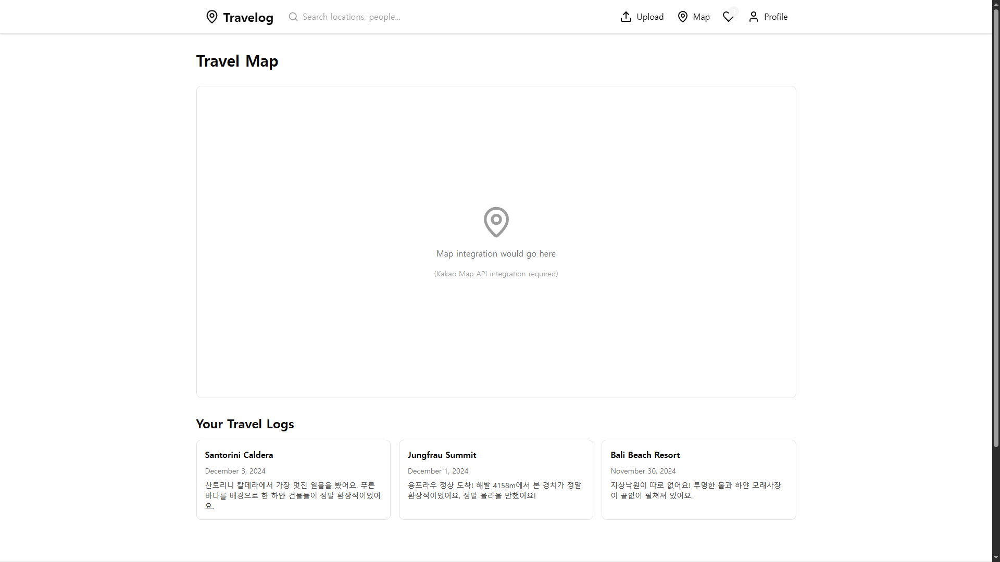
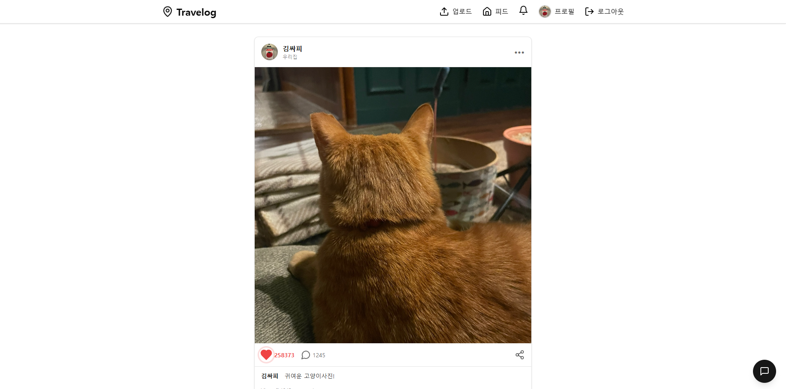
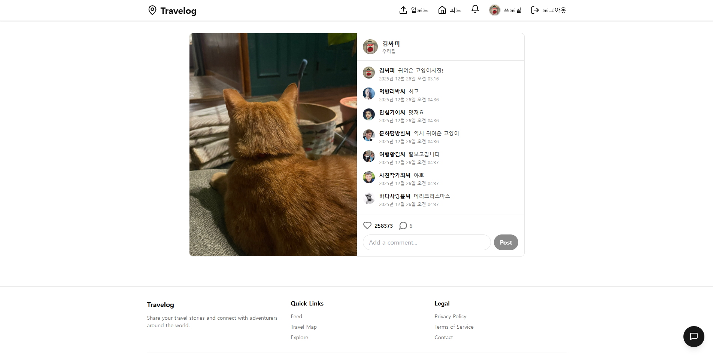
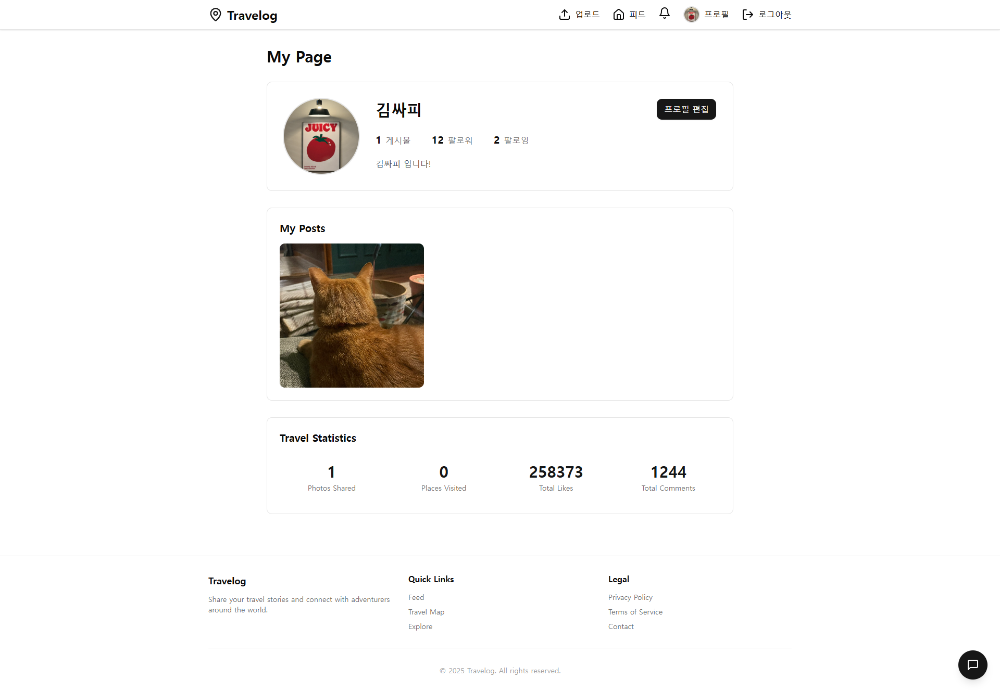
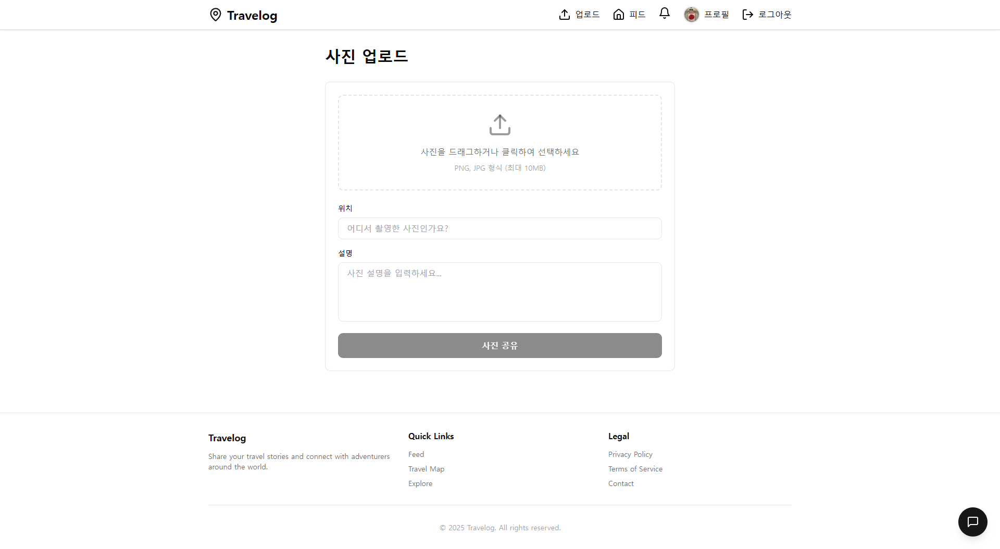

# ✈️ Travelog (트래블로그)
> **여행의 순간을 기록하고, 취향에 맞는 여행지를 추천받는 소셜 웹 플랫폼**

## 📅 프로젝트 개요
* **개발 기간**: 2024.11.20 ~ 2024.12.31 (총 6주)
* **팀 구성**: 2인 팀 프로젝트
* **주요 기능**:
  - 여행 기록(Travel Log) 작성 및 관리
  - 소셜 피드(SNS) 기능 (팔로우, 좋아요, 댓글)
  - AI 기반 개인화 여행지 추천 (Google Gemini API)
  - 카카오맵 API를 활용한 지도 기반 여행 경로 시각화

---

## 🛠️ Tech Stack

### Backend
    
* **Language**: Java 17
* **Framework**: Spring Boot 3.3.x
* **Build Tool**: Maven
* **Database**: MySQL 8.0
* **Auth**: Spring Security + JWT (Json Web Token)
* **ORM**: MyBatis
* **AI**: Google Gemini API (여행지 추천)
* **API Docs**: SpringDoc (Swagger)
* **Storage**: AWS S3 (이미지 업로드)

### Frontend
  
* **Framework**: Vue.js 3 (Composition API)
* **State Management**: Pinia
* **HTTP Client**: Axios
* **Map API**: Kakao Maps API
* **Styling**: Tailwind CSS

### Collaboration
  

---

## 📄 문서

### API 명세서
API 명세서는 노션(Notion)을 통해 관리하고 있으며, Swagger를 통해 실시간 테스트가 가능합니다.

* **[👉 API 명세서 (Notion Link) 바로가기](https://www.notion.so/API-2b293e7eb35481659a4efc7c40de691c)**
* **Swagger UI**: `http://localhost:8080/swagger-ui/index.html` (서버 실행 시)

### 설계 문서
* **[Use-Case 다이어그램](./docs/USE_CASE_DIAGRAM.md)** - 시스템 사용 사례 및 액터 관계
* **[Class 다이어그램](./docs/CLASS_DIAGRAM.md)** - 클래스 구조 및 계층별 설계
* **[ERD 설계서](./database/ERD_DESIGN.md)** - 데이터베이스 설계 및 테이블 구조

---

## ✅ 주요 구현 기능

### 🔐 **인증 및 사용자 관리**
- [x] Spring Security + JWT 기반 회원가입/로그인
- [x] 사용자 프로필 관리 (닉네임, 프로필 이미지, 자기소개)
- [x] 팔로우/언팔로우 기능
- [x] 팔로워/팔로잉 목록 조회

### 🗺️ **지도 및 관광지**
- [x] Kakao Map API 연동 및 지도 출력
- [x] 공공 데이터 API 연동 (관광지 정보)
- [x] 지역별/테마별 관광지 조회
- [x] 관광지 상세 정보 표시

### ✈️ **여행 기록 (Travel Log)**
- [x] 여행 기록 작성 (제목, 일정, 예산, 테마)
- [x] 여행 경로 상세 정보 등록 (순서, 후기, 비용, 사진)
- [x] 여행 기록 수정/삭제
- [x] 여행 기록 공개/비공개 설정
- [x] 지도 상에서 여행 경로 시각화

### 📱 **소셜 피드 (SNS)**
- [x] 게시글(Post) 작성/수정/삭제
- [x] 이미지 업로드 (AWS S3)
- [x] 게시글 좋아요 기능
- [x] 댓글 작성/삭제
- [x] 팔로잉 사용자 피드 조회
- [x] 게시글 상세 보기

### 🔔 **알림 시스템**
- [x] 좋아요 알림
- [x] 댓글 알림
- [x] 팔로우 알림
- [x] 읽음/읽지 않음 상태 관리

### 🤖 **AI 기반 추천**
- [x] Google Gemini API 연동
- [x] 사용자 여행 기록 및 테마 기반 여행지 추천
- [x] 개인화된 추천 결과 제공

### 👤 **마이페이지**
- [x] 내 여행 기록 목록
- [x] 내가 작성한 게시글 목록
- [x] 여행 통계 대시보드
- [x] 팔로워/팔로잉 관리

---

## 📂 프로젝트 구조

### Backend
```text
travelog/src/main/java/com/ssafy/travelog
│
├── config/                  # 설정 파일
│   ├── SecurityConfig.java     # Spring Security 설정
│   ├── JwtAuthenticationFilter.java  # JWT 필터
│   ├── GMSConfig.java          # Gemini API 설정
│   └── WebMvcConfig.java       # CORS, Interceptor 설정
│
├── controller/              # REST API 컨트롤러
│   ├── UserController.java     # 회원 관리 (인증, 팔로우)
│   ├── BoardController.java    # 게시글 (Post)
│   ├── TravelRecordController.java  # 여행 기록
│   ├── CommentController.java  # 댓글
│   ├── LikeController.java     # 좋아요
│   ├── NotificationController.java  # 알림
│   ├── FileController.java     # 파일 업로드 (AWS S3)
│   └── GMSController.java      # AI 추천 (Gemini)
│
├── model/
│   ├── dto/                 # Data Transfer Object
│   ├── mapper/              # MyBatis Mapper Interface
│   └── service/             # 비즈니스 로직
│
├── exception/               # 예외 처리
└── util/                    # 유틸리티 (JWT, 파일 업로드)
```

### Frontend
```text
front/src/
│
├── api/                     # Axios API 모듈
├── assets/                  # 정적 파일 (이미지, CSS)
├── components/              # 재사용 컴포넌트
├── router/                  # Vue Router 설정
├── stores/                  # Pinia 상태 관리
├── utils/                   # 유틸리티 함수
└── views/                   # 페이지 컴포넌트
    ├── FeedView.vue         # 피드 페이지
    ├── MapView.vue          # 지도/관광지 검색
    ├── UploadView.vue       # 게시글 작성
    ├── PostDetailView.vue   # 게시글 상세
    ├── MyPageView.vue       # 마이페이지
    ├── ProfileView.vue      # 타 유저 프로필
    └── NotificationsView.vue  # 알림
```

---

## 🌐 주요 API 엔드포인트

| 기능 | Method | Endpoint | 설명 |
|------|--------|----------|------|
| **인증** | POST | `/api/users/register` | 회원가입 |
| | POST | `/api/users/login` | 로그인 |
| **게시글** | GET | `/api/posts` | 게시글 목록 (피드) |
| | POST | `/api/posts` | 게시글 작성 |
| | GET | `/api/posts/{id}` | 게시글 상세 |
| | PUT | `/api/posts/{id}` | 게시글 수정 |
| | DELETE | `/api/posts/{id}` | 게시글 삭제 |
| **여행기록** | GET | `/api/travels` | 여행 기록 목록 |
| | POST | `/api/travels` | 여행 기록 작성 |
| | GET | `/api/travels/{id}` | 여행 기록 상세 |
| | PUT | `/api/travels/{id}` | 여행 기록 수정 |
| | DELETE | `/api/travels/{id}` | 여행 기록 삭제 |
| **소셜** | POST | `/api/likes` | 좋아요 |
| | DELETE | `/api/likes` | 좋아요 취소 |
| | POST | `/api/comments` | 댓글 작성 |
| | DELETE | `/api/comments/{id}` | 댓글 삭제 |
| **팔로우** | POST | `/api/users/follow/{userId}` | 팔로우 |
| | DELETE | `/api/users/follow/{userId}` | 언팔로우 |
| **알림** | GET | `/api/notifications` | 알림 목록 |
| | PUT | `/api/notifications/{id}/read` | 알림 읽음 처리 |
| **AI 추천** | GET | `/api/gms` | 여행지 추천 |
| **파일** | POST | `/api/files/upload` | 이미지 업로드 (S3) |

자세한 API 명세는 [**Notion 문서**](https://www.notion.so/API-2b293e7eb35481659a4efc7c40de691c) 또는 Swagger UI를 참고하세요.

---

## 🎯 주요 기술 특징

### 1️⃣ Spring Security + JWT 인증 시스템
- JWT 기반 stateless 인증 구현
- JwtAuthenticationFilter를 통한 요청 검증
- 토큰 갱신 및 만료 처리

### 2️⃣ AI 기반 개인화 추천
- Google Gemini API를 활용한 여행지 추천
- 사용자 여행 히스토리 및 선호 테마 분석
- 자연어 기반 맞춤형 추천 제공

### 3️⃣ 효율적인 파일 업로드
- AWS S3 연동을 통한 이미지 저장
- Presigned URL을 활용한 안전한 파일 업로드
- 여러 이미지 동시 업로드 지원

### 4️⃣ 실시간 알림 시스템
- 팔로우, 좋아요, 댓글 시 실시간 알림 생성
- 읽음/읽지 않음 상태 관리
- 알림 타입별 분류 및 표시

### 5️⃣ 지도 기반 여행 경로 시각화
- Kakao Maps API를 활용한 인터랙티브 지도
- 여행 경로를 지도 상에 표시
- 마커 클릭 시 관광지 상세 정보 팝업

---

## 📸 스크린샷

### 메인 페이지 (지도 및 관광지 검색)


### 피드 페이지


### 게시글 상세



### 마이 페이지


### 게시글 업로드


---

## 🚀 실행 방법

### Backend
```bash
cd travelog
mvn spring-boot:run
```

### Frontend
```bash
cd front
npm install
npm run dev
```

### 환경 변수 설정
`application.properties` 또는 `.env` 파일에 다음 설정 필요:
- MySQL 데이터베이스 연결 정보
- JWT Secret Key
- AWS S3 Credentials
- Google Gemini API Key
- Kakao Maps API Key

---

## 👥 팀원 및 역할

| 이름 | 역할 | 담당 기능 |
|------|------|----------|
| 팀원1 | Backend | 인증/인가, 게시글, 여행기록 API |
| 팀원2 | Frontend | UI/UX, 지도 연동, 상태 관리 |

---

## 📝 라이센스

이 프로젝트는 학습 목적으로 제작되었습니다.

---

## 🔗 관련 링크

### 문서
- [API 명세서 (Notion)](https://www.notion.so/API-2b293e7eb35481659a4efc7c40de691c)
- [Swagger UI](http://localhost:8080/swagger-ui/index.html)
- [Use-Case 다이어그램](./docs/USE_CASE_DIAGRAM.md)
- [Class 다이어그램](./docs/CLASS_DIAGRAM.md)
- [ERD 설계서](./database/ERD_DESIGN.md)

### 외부 API
- [Kakao Maps API](https://apis.map.kakao.com/)
- [Google Gemini API](https://ai.google.dev/)
- [공공 데이터 포털](https://www.data.go.kr/)