# Class Diagram

## Travelog 시스템 클래스 다이어그램

### 다이어그램 이미지

> SVG 이미지가 표시되지 않는 경우, [JPG 버전](../image/doc/ClassDiagram.jpg)을 확인하세요.

### Mermaid 소스 코드

```mermaid
classDiagram
    %% ============================================
    %% DTO (Data Transfer Object) Classes
    %% ============================================
    class UserDto {
        -int id
        -String email
        -String password
        -String nickname
        -String profileImage
        -String bio
        -String role
        -Integer followerCount
        -Integer followingCount
        +getId() int
        +setEmail(String) void
        +getNickname() String
    }

    class PostDto {
        -int id
        -int userId
        -String imageUrl
        -String travelLocation
        -String caption
        -int likeCount
        -int commentCount
        -String createdAt
        -String updatedAt
        -String userNickname
        -String userProfileImage
        +getId() int
        +setImageUrl(String) void
    }

    class TravelRecordDto {
        -int id
        -String userEmail
        -String nickname
        -String title
        -String startDate
        -String endDate
        -BigDecimal totalCost
        -String theme
        -boolean isPublic
        -List~String~ imageUrls
        -String address
        -Double latitude
        -Double longitude
        -String createdAt
        +getId() int
        +setTitle(String) void
    }

    class TravelDetailDto {
        -int id
        -int travelRecordId
        -Integer touristSpotId
        -int sequenceOrder
        -String locationName
        -String description
        -String review
        -BigDecimal cost
        -String visitDate
        -List~String~ imageUrls
        -String photos
        -Double latitude
        -Double longitude
        +getId() int
        +setLocationName(String) void
    }

    class CommentDto {
        -int id
        -int postId
        -String userEmail
        -String nickname
        -String profileImage
        -String content
        -String createdAt
        +getId() int
        +setContent(String) void
    }

    class LikeDto {
        -int postId
        -String userEmail
        +getPostId() int
        +setUserEmail(String) void
    }

    class FollowDto {
        -int id
        -int followerId
        -int followingId
        -String createdAt
        +getId() int
        +setFollowerId(int) void
    }

    class NotificationDto {
        -int id
        -String userEmail
        -String actorEmail
        -String type
        -Integer postId
        -Integer commentId
        -Boolean isRead
        -String createdAt
        -String actorNickname
        -String actorProfileImage
        +getId() int
        +setIsRead(Boolean) void
    }

    %% ============================================
    %% Service Interfaces
    %% ============================================
    class UserService {
        <<interface>>
        +join(UserDto) void
        +login(UserDto) UserDto
        +updateUser(UserDto) void
        +getUserByEmail(String) UserDto
        +deleteUser(String) void
        +getUserById(int) UserDto
        +toggleFollow(String, String) Map
        +isFollowing(String, String) boolean
        +getMyInfo(String) UserDto
    }

    class BoardService {
        <<interface>>
        +writePost(BoardDto) void
        +listPosts() List~BoardDto~
        +deletePost(int, String) void
    }

    class PostService {
        <<interface>>
        +createPost(PostDto) void
        +getPostById(int) PostDto
        +updatePost(PostDto) void
        +deletePost(int) void
        +getAllPosts() List~PostDto~
        +getPostsByUser(int) List~PostDto~
    }

    class TravelRecordService {
        <<interface>>
        +createTravelRecord(TravelRecordDto) void
        +getTravelRecordById(int) TravelRecordDto
        +updateTravelRecord(TravelRecordDto) void
        +deleteTravelRecord(int) void
        +getTravelRecordsByUser(String) List~TravelRecordDto~
    }

    class CommentService {
        <<interface>>
        +createComment(CommentDto) void
        +getCommentsByPost(int) List~CommentDto~
        +deleteComment(int) void
    }

    class LikeService {
        <<interface>>
        +toggleLike(LikeDto) Map
        +isLiked(int, String) boolean
        +getLikeCount(int) int
    }

    class NotificationService {
        <<interface>>
        +createNotification(NotificationDto) void
        +getNotifications(String) List~NotificationDto~
        +markAsRead(int) void
        +deleteNotification(int) void
    }

    class GMSService {
        <<interface>>
        +sendMessage(List~String~, List~String~) String
    }

    class FileService {
        <<interface>>
        +uploadFile(MultipartFile) String
        +deleteFile(String) void
    }

    %% ============================================
    %% Service Implementations
    %% ============================================
    class UserServiceImpl {
        -UserMapper userMapper
        -FollowMapper followMapper
        +join(UserDto) void
        +login(UserDto) UserDto
        +updateUser(UserDto) void
        +toggleFollow(String, String) Map
    }

    class PostServiceImpl {
        -PostMapper postMapper
        +createPost(PostDto) void
        +getPostById(int) PostDto
        +updatePost(PostDto) void
    }

    class TravelRecordServiceImpl {
        -TravelRecordMapper travelRecordMapper
        -TravelDetailMapper travelDetailMapper
        +createTravelRecord(TravelRecordDto) void
        +getTravelRecordById(int) TravelRecordDto
    }

    class CommentServiceImpl {
        -CommentMapper commentMapper
        +createComment(CommentDto) void
        +getCommentsByPost(int) List~CommentDto~
    }

    class LikeServiceImpl {
        -LikeMapper likeMapper
        +toggleLike(LikeDto) Map
        +isLiked(int, String) boolean
    }

    class NotificationServiceImpl {
        -NotificationMapper notificationMapper
        +createNotification(NotificationDto) void
        +getNotifications(String) List~NotificationDto~
    }

    class GMSServiceImpl {
        -RestTemplate restTemplate
        -String apiKey
        +sendMessage(List~String~, List~String~) String
    }

    %% ============================================
    %% Controllers
    %% ============================================
    class UserController {
        -UserService userService
        -JwtUtil jwtUtil
        +register(UserDto) ResponseEntity
        +login(UserDto) ResponseEntity
        +getMyInfo(String) ResponseEntity
        +updateProfile(UserDto) ResponseEntity
        +followUser(String, String) ResponseEntity
        +unfollowUser(String, String) ResponseEntity
    }

    class BoardController {
        -BoardService boardService
        +createPost(BoardDto) ResponseEntity
        +getPosts() ResponseEntity
        +deletePost(int, String) ResponseEntity
    }

    class TravelRecordController {
        -TravelRecordService travelRecordService
        +createTravel(TravelRecordDto) ResponseEntity
        +getTravel(int) ResponseEntity
        +updateTravel(TravelRecordDto) ResponseEntity
        +deleteTravel(int) ResponseEntity
    }

    class CommentController {
        -CommentService commentService
        +createComment(CommentDto) ResponseEntity
        +getComments(int) ResponseEntity
        +deleteComment(int) ResponseEntity
    }

    class LikeController {
        -LikeService likeService
        +toggleLike(LikeDto) ResponseEntity
        +checkLike(int, String) ResponseEntity
    }

    class NotificationController {
        -NotificationService notificationService
        +getNotifications(String) ResponseEntity
        +markAsRead(int) ResponseEntity
    }

    class GMSController {
        -GMSService gmsService
        +chat(List~String~, List~String~) String
    }

    class FileController {
        -FileService fileService
        +uploadFile(MultipartFile) ResponseEntity
    }

    %% ============================================
    %% Mappers (MyBatis)
    %% ============================================
    class UserMapper {
        <<interface>>
        +insertUser(UserDto) void
        +selectUserByEmail(String) UserDto
        +updateUser(UserDto) void
        +deleteUser(String) void
    }

    class PostMapper {
        <<interface>>
        +insertPost(PostDto) void
        +selectPostById(int) PostDto
        +updatePost(PostDto) void
        +deletePost(int) void
    }

    class TravelRecordMapper {
        <<interface>>
        +insertTravelRecord(TravelRecordDto) void
        +selectTravelRecordById(int) TravelRecordDto
        +updateTravelRecord(TravelRecordDto) void
        +deleteTravelRecord(int) void
    }

    class CommentMapper {
        <<interface>>
        +insertComment(CommentDto) void
        +selectCommentsByPostId(int) List~CommentDto~
        +deleteComment(int) void
    }

    class LikeMapper {
        <<interface>>
        +insertLike(LikeDto) void
        +deleteLike(LikeDto) void
        +selectLike(LikeDto) LikeDto
    }

    class FollowMapper {
        <<interface>>
        +insertFollow(FollowDto) void
        +deleteFollow(FollowDto) void
        +selectFollow(FollowDto) FollowDto
    }

    class NotificationMapper {
        <<interface>>
        +insertNotification(NotificationDto) void
        +selectNotificationsByUser(String) List~NotificationDto~
        +updateNotification(NotificationDto) void
    }

    %% ============================================
    %% Utility Classes
    %% ============================================
    class JwtUtil {
        -String secretKey
        -long expirationTime
        +generateToken(String) String
        +validateToken(String) boolean
        +getEmailFromToken(String) String
    }

    class JwtAuthenticationFilter {
        -JwtUtil jwtUtil
        +doFilterInternal(HttpServletRequest, HttpServletResponse, FilterChain) void
    }

    class SecurityConfig {
        -JwtAuthenticationFilter jwtAuthenticationFilter
        +securityFilterChain(HttpSecurity) SecurityFilterChain
        +passwordEncoder() PasswordEncoder
    }

    %% ============================================
    %% Relationships - DTO Associations
    %% ============================================
    UserDto "1" --o "0..*" PostDto : creates
    UserDto "1" --o "0..*" TravelRecordDto : creates
    UserDto "1" --o "0..*" CommentDto : writes
    UserDto "1" --o "0..*" NotificationDto : receives
    PostDto "1" --o "0..*" CommentDto : has
    PostDto "1" --o "0..*" LikeDto : receives
    TravelRecordDto "1" --o "0..*" TravelDetailDto : contains
    UserDto "0..*" --o "0..*" UserDto : follows

    %% ============================================
    %% Relationships - Service Layer
    %% ============================================
    UserService <|.. UserServiceImpl : implements
    BoardService <|.. BoardServiceImpl : implements
    PostService <|.. PostServiceImpl : implements
    TravelRecordService <|.. TravelRecordServiceImpl : implements
    CommentService <|.. CommentServiceImpl : implements
    LikeService <|.. LikeServiceImpl : implements
    NotificationService <|.. NotificationServiceImpl : implements
    GMSService <|.. GMSServiceImpl : implements

    %% ============================================
    %% Relationships - Controller to Service
    %% ============================================
    UserController --> UserService : uses
    BoardController --> BoardService : uses
    TravelRecordController --> TravelRecordService : uses
    CommentController --> CommentService : uses
    LikeController --> LikeService : uses
    NotificationController --> NotificationService : uses
    GMSController --> GMSService : uses
    FileController --> FileService : uses

    %% ============================================
    %% Relationships - Service to Mapper
    %% ============================================
    UserServiceImpl --> UserMapper : uses
    UserServiceImpl --> FollowMapper : uses
    PostServiceImpl --> PostMapper : uses
    TravelRecordServiceImpl --> TravelRecordMapper : uses
    CommentServiceImpl --> CommentMapper : uses
    LikeServiceImpl --> LikeMapper : uses
    NotificationServiceImpl --> NotificationMapper : uses

    %% ============================================
    %% Relationships - Security
    %% ============================================
    UserController --> JwtUtil : uses
    JwtAuthenticationFilter --> JwtUtil : uses
    SecurityConfig --> JwtAuthenticationFilter : configures
```

---

## 계층별 클래스 설명

### 1. Presentation Layer (Controller)

**역할**: HTTP 요청을 받아 Service 계층에 전달하고, 응답을 반환

| 클래스 | 책임 | 주요 엔드포인트 |
|--------|------|-----------------|
| UserController | 회원 관리 및 인증 | POST /api/users/register, /login |
| BoardController | 게시글 관리 | GET/POST/DELETE /api/posts |
| TravelRecordController | 여행 기록 관리 | CRUD /api/travels |
| CommentController | 댓글 관리 | POST/DELETE /api/comments |
| LikeController | 좋아요 관리 | POST/DELETE /api/likes |
| NotificationController | 알림 관리 | GET /api/notifications |
| GMSController | AI 추천 | GET /api/gms |
| FileController | 파일 업로드 | POST /api/files/upload |

---

### 2. Business Layer (Service)

**역할**: 비즈니스 로직 처리 및 트랜잭션 관리

| 인터페이스 | 구현체 | 주요 기능 |
|-----------|--------|----------|
| UserService | UserServiceImpl | 회원가입, 로그인, 프로필 관리, 팔로우 |
| PostService | PostServiceImpl | 게시글 CRUD, 피드 조회 |
| TravelRecordService | TravelRecordServiceImpl | 여행 기록 CRUD |
| CommentService | CommentServiceImpl | 댓글 CRUD |
| LikeService | LikeServiceImpl | 좋아요 토글, 좋아요 수 조회 |
| NotificationService | NotificationServiceImpl | 알림 생성 및 조회 |
| GMSService | GMSServiceImpl | Gemini API 호출 |
| FileService | FileServiceImpl | S3 파일 업로드 |

---

### 3. Data Access Layer (Mapper)

**역할**: MyBatis를 통한 데이터베이스 접근

| 인터페이스 | 매핑 XML | 주요 쿼리 |
|-----------|----------|----------|
| UserMapper | UserMapper.xml | INSERT, SELECT, UPDATE, DELETE users |
| PostMapper | PostMapper.xml | 게시글 CRUD, 피드 조회 |
| TravelRecordMapper | TravelRecordMapper.xml | 여행 기록 CRUD |
| CommentMapper | CommentMapper.xml | 댓글 CRUD |
| LikeMapper | LikeMapper.xml | 좋아요 INSERT/DELETE |
| FollowMapper | FollowMapper.xml | 팔로우 INSERT/DELETE |
| NotificationMapper | NotificationMapper.xml | 알림 CRUD |

---

### 4. DTO (Data Transfer Object)

**역할**: 계층 간 데이터 전송 및 검증

| 클래스 | 주요 필드 | 용도 |
|--------|----------|------|
| UserDto | id, email, nickname, profileImage | 사용자 정보 전달 |
| PostDto | id, userId, imageUrl, caption | 게시글 정보 전달 |
| TravelRecordDto | id, title, startDate, endDate, totalCost | 여행 기록 정보 |
| TravelDetailDto | id, travelRecordId, locationName | 여행 상세 정보 |
| CommentDto | id, postId, content | 댓글 정보 |
| LikeDto | postId, userEmail | 좋아요 정보 |
| FollowDto | followerId, followingId | 팔로우 관계 |
| NotificationDto | type, actorEmail, postId | 알림 정보 |

---

### 5. Security & Utility

| 클래스 | 역할 |
|--------|------|
| JwtUtil | JWT 토큰 생성, 검증, 파싱 |
| JwtAuthenticationFilter | JWT 기반 인증 필터 |
| SecurityConfig | Spring Security 설정 |

---

## 주요 설계 패턴

### 1. Layered Architecture (계층화 아키텍처)
- **Presentation Layer**: Controller
- **Business Layer**: Service
- **Data Access Layer**: Mapper

### 2. Dependency Injection (의존성 주입)
- Spring의 @Autowired를 통한 의존성 주입
- 인터페이스 기반 설계로 결합도 최소화

### 3. DTO Pattern
- Entity와 DTO 분리
- 계층 간 데이터 전송 최적화

### 4. Repository Pattern (MyBatis Mapper)
- 데이터 접근 로직 캡슐화
- XML 기반 SQL 매핑

---

## 클래스 간 주요 관계

### 연관 관계 (Association)
- `UserDto` 1 → N `PostDto`: 한 사용자가 여러 게시글 작성
- `UserDto` 1 → N `TravelRecordDto`: 한 사용자가 여러 여행 기록 작성
- `PostDto` 1 → N `CommentDto`: 한 게시글에 여러 댓글
- `TravelRecordDto` 1 → N `TravelDetailDto`: 한 여행 기록에 여러 상세 정보

### 의존 관계 (Dependency)
- Controller → Service
- Service → Mapper
- Service → DTO

### 구현 관계 (Realization)
- ServiceImpl implements Service
- Mapper implements MyBatis Interface

---

## 외부 시스템 연동

### AWS S3
- **FileService**: 이미지 업로드/삭제
- **사용 위치**: 프로필 이미지, 게시글 이미지, 여행 사진

### Google Gemini API
- **GMSService**: AI 기반 여행지 추천
- **입력**: 사용자 여행 히스토리, 선호 테마
- **출력**: 추천 여행지 목록

### Kakao Maps API
- **Frontend 직접 연동**
- **기능**: 지도 표시, 관광지 위치 시각화
