# Use-Case Diagram

## Travelog 시스템 Use-Case 다이어그램

### 다이어그램 이미지

### Mermaid 소스 코드

```mermaid
graph TB
    subgraph "Travelog System"
        %% 인증 및 사용자 관리
        UC1[회원가입]
        UC2[로그인]
        UC3[프로필 관리]
        UC4[프로필 조회]

        %% 소셜 기능
        UC5[팔로우/언팔로우]
        UC6[팔로워 목록 조회]

        %% 게시글 관리
        UC7[게시글 작성]
        UC8[게시글 조회]
        UC9[게시글 수정]
        UC10[게시글 삭제]
        UC11[피드 조회]

        %% 소셜 인터랙션
        UC12[좋아요]
        UC13[댓글 작성]
        UC14[댓글 삭제]

        %% 여행 기록
        UC15[여행 기록 작성]
        UC16[여행 기록 조회]
        UC17[여행 기록 수정]
        UC18[여행 기록 삭제]
        UC19[여행 경로 시각화]

        %% 관광지
        UC20[관광지 검색]
        UC21[관광지 상세 조회]
        UC22[지도에서 관광지 보기]

        %% 알림
        UC23[알림 조회]
        UC24[알림 읽음 처리]

        %% AI 추천
        UC25[AI 여행지 추천]

        %% 파일 업로드
        UC26[이미지 업로드]
    end

    %% 액터
    User([사용자])
    System([외부 시스템])

    %% 사용자 - 인증
    User --> UC1
    User --> UC2
    User --> UC3
    User --> UC4

    %% 사용자 - 소셜
    User --> UC5
    User --> UC6

    %% 사용자 - 게시글
    User --> UC7
    User --> UC8
    User --> UC9
    User --> UC10
    User --> UC11

    %% 사용자 - 인터랙션
    User --> UC12
    User --> UC13
    User --> UC14

    %% 사용자 - 여행 기록
    User --> UC15
    User --> UC16
    User --> UC17
    User --> UC18
    User --> UC19

    %% 사용자 - 관광지
    User --> UC20
    User --> UC21
    User --> UC22

    %% 사용자 - 알림
    User --> UC23
    User --> UC24

    %% 사용자 - AI 추천
    User --> UC25

    %% Include 관계
    UC7 -.->|include| UC26
    UC15 -.->|include| UC26
    UC3 -.->|include| UC26

    %% 외부 시스템 관계
    UC22 --> System
    UC25 --> System
    UC26 --> System

    %% Extend 관계
    UC8 -.->|extend| UC12
    UC8 -.->|extend| UC13
    UC16 -.->|extend| UC19
```

## Use-Case 목록

### 1. 인증 및 사용자 관리
| Use-Case ID | Use-Case 명 | 설명 | 액터 |
|-------------|------------|------|------|
| UC1 | 회원가입 | 새로운 계정을 생성한다 | 사용자 |
| UC2 | 로그인 | JWT 토큰을 발급받아 인증한다 | 사용자 |
| UC3 | 프로필 관리 | 닉네임, 프로필 이미지, 자기소개를 수정한다 | 사용자 |
| UC4 | 프로필 조회 | 자신 또는 다른 사용자의 프로필을 조회한다 | 사용자 |

### 2. 소셜 기능
| Use-Case ID | Use-Case 명 | 설명 | 액터 |
|-------------|------------|------|------|
| UC5 | 팔로우/언팔로우 | 다른 사용자를 팔로우하거나 언팔로우한다 | 사용자 |
| UC6 | 팔로워 목록 조회 | 팔로워 또는 팔로잉 목록을 조회한다 | 사용자 |

### 3. 게시글 관리
| Use-Case ID | Use-Case 명 | 설명 | 액터 |
|-------------|------------|------|------|
| UC7 | 게시글 작성 | 여행 사진과 설명을 담은 게시글을 작성한다 | 사용자 |
| UC8 | 게시글 조회 | 특정 게시글의 상세 정보를 조회한다 | 사용자 |
| UC9 | 게시글 수정 | 작성한 게시글을 수정한다 | 사용자 |
| UC10 | 게시글 삭제 | 작성한 게시글을 삭제한다 | 사용자 |
| UC11 | 피드 조회 | 팔로잉한 사용자들의 게시글을 조회한다 | 사용자 |

### 4. 소셜 인터랙션
| Use-Case ID | Use-Case 명 | 설명 | 액터 |
|-------------|------------|------|------|
| UC12 | 좋아요 | 게시글에 좋아요를 누르거나 취소한다 | 사용자 |
| UC13 | 댓글 작성 | 게시글에 댓글을 작성한다 | 사용자 |
| UC14 | 댓글 삭제 | 작성한 댓글을 삭제한다 | 사용자 |

### 5. 여행 기록
| Use-Case ID | Use-Case 명 | 설명 | 액터 |
|-------------|------------|------|------|
| UC15 | 여행 기록 작성 | 여행 일정, 경로, 비용 등을 기록한다 | 사용자 |
| UC16 | 여행 기록 조회 | 저장된 여행 기록을 조회한다 | 사용자 |
| UC17 | 여행 기록 수정 | 작성한 여행 기록을 수정한다 | 사용자 |
| UC18 | 여행 기록 삭제 | 작성한 여행 기록을 삭제한다 | 사용자 |
| UC19 | 여행 경로 시각화 | 지도 위에 여행 경로를 시각화한다 | 사용자 |

### 6. 관광지
| Use-Case ID | Use-Case 명 | 설명 | 액터 |
|-------------|------------|------|------|
| UC20 | 관광지 검색 | 지역/테마별로 관광지를 검색한다 | 사용자 |
| UC21 | 관광지 상세 조회 | 관광지의 상세 정보를 조회한다 | 사용자 |
| UC22 | 지도에서 관광지 보기 | 카카오맵에서 관광지 위치를 확인한다 | 사용자, 외부 시스템 |

### 7. 알림
| Use-Case ID | Use-Case 명 | 설명 | 액터 |
|-------------|------------|------|------|
| UC23 | 알림 조회 | 받은 알림 목록을 조회한다 | 사용자 |
| UC24 | 알림 읽음 처리 | 알림을 읽음 상태로 변경한다 | 사용자 |

### 8. AI 추천
| Use-Case ID | Use-Case 명 | 설명 | 액터 |
|-------------|------------|------|------|
| UC25 | AI 여행지 추천 | 사용자 취향에 맞는 여행지를 추천받는다 | 사용자, 외부 시스템 |

### 9. 파일 관리
| Use-Case ID | Use-Case 명 | 설명 | 액터 |
|-------------|------------|------|------|
| UC26 | 이미지 업로드 | AWS S3에 이미지를 업로드한다 | 사용자, 외부 시스템 |

## 관계 설명

### Include 관계
- **게시글 작성 → 이미지 업로드**: 게시글 작성 시 반드시 이미지를 업로드해야 함
- **여행 기록 작성 → 이미지 업로드**: 여행 기록 작성 시 여행 사진을 업로드할 수 있음
- **프로필 관리 → 이미지 업로드**: 프로필 이미지 변경 시 이미지 업로드 필요

### Extend 관계
- **게시글 조회 → 좋아요**: 게시글을 조회하면 좋아요를 누를 수 있음
- **게시글 조회 → 댓글 작성**: 게시글을 조회하면 댓글을 작성할 수 있음
- **여행 기록 조회 → 여행 경로 시각화**: 여행 기록을 조회할 때 지도에 경로를 시각화할 수 있음

### 외부 시스템 연동
- **지도에서 관광지 보기**: Kakao Maps API 사용
- **AI 여행지 추천**: Google Gemini API 사용
- **이미지 업로드**: AWS S3 사용

## 액터 설명

### 사용자 (User)
- **역할**: Travelog 서비스를 이용하는 일반 사용자
- **권한**:
  - 회원가입 및 로그인
  - 게시글 및 여행 기록 작성
  - 다른 사용자와 소셜 인터랙션
  - 관광지 검색 및 조회
  - AI 추천 이용

### 외부 시스템 (External System)
- **포함 시스템**:
  - Kakao Maps API: 지도 및 위치 정보 제공
  - Google Gemini API: AI 기반 여행지 추천
  - AWS S3: 이미지 파일 스토리지
  - 공공 데이터 API: 관광지 정보 제공
